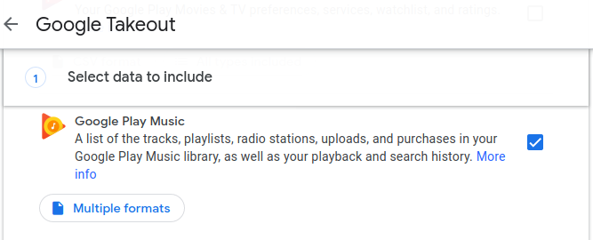

# gpm-analyser
Playing around with R to display a user's Google Play Music data in a more usable format. 

#### Download your Google Takeout [here](https://takeout.google.com/settings/takeout). 
Make sure Google Play Music data is included in your export: 

#### To run: 
- Run `Rscript app/app.R` from `gpm-analyser/`
- Select your unzipped Google Takeout file when prompted
